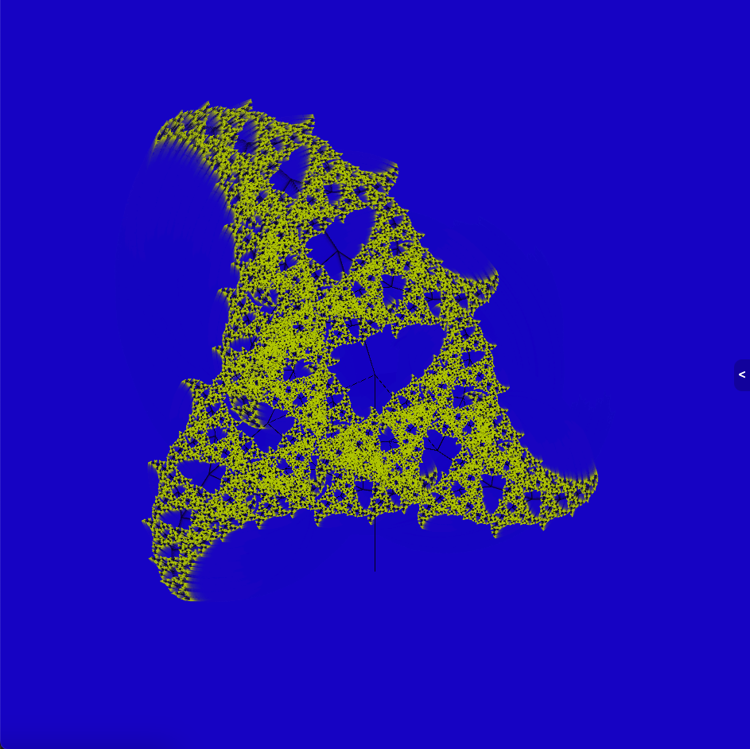

# Fractal Clock
[fractalclock.com](https://fractalclock.com)

A Fractal Clock. Check it out.

(Not animated but go to [fractalclock.com](https://fractalclock.com) to see it animated)

Notes:
- Built with React, uses HTML5 Canvas to render.
- All clocks will look the same and should be synchronized (Unless you change the settings). Try it out in a new window or on a different device!
- It has a chat, because I thought that would be fun. The chat will persist until it gets large enough to warrant limits on it. To use the chat, press the button on the right side of the screen. The chat server is running on AWS Lambda.
- There are settings to make the clock look slightly different, and they're fun to play with. To change the settings, hover your mouse in the top left corner of the screen.
